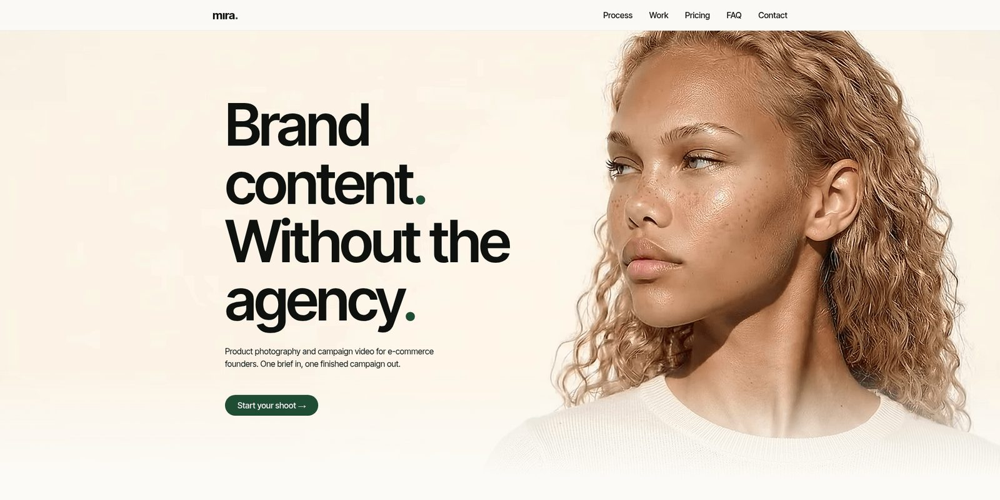
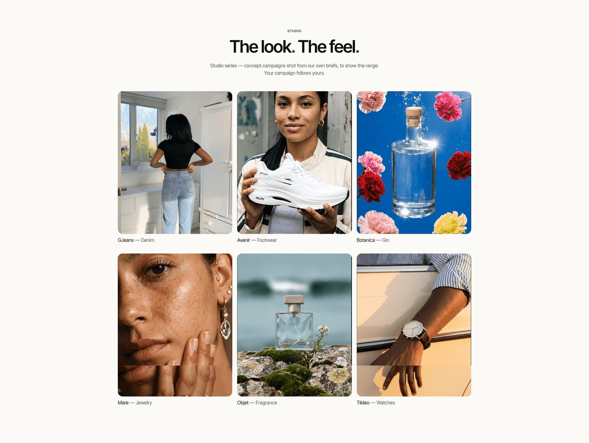
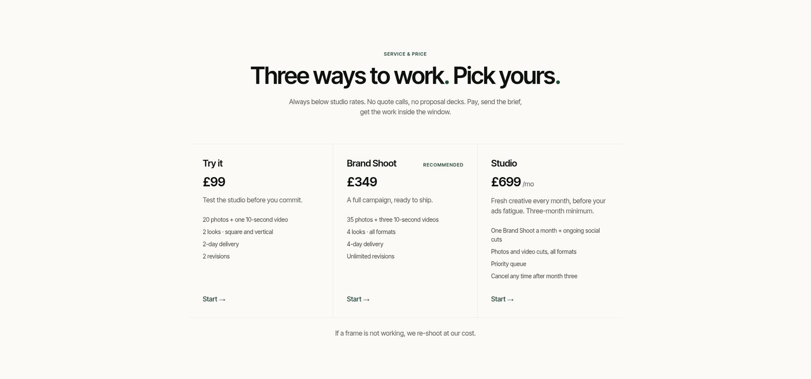
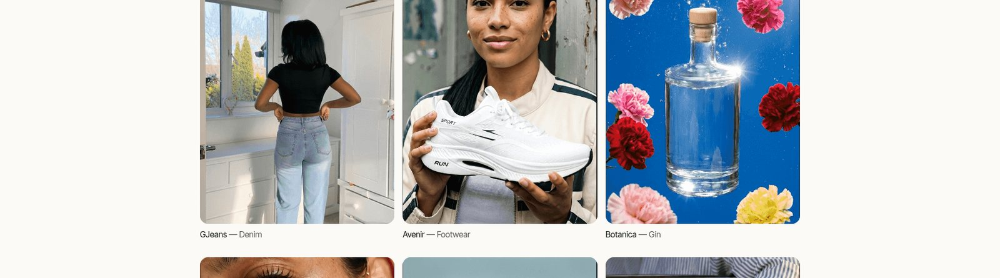
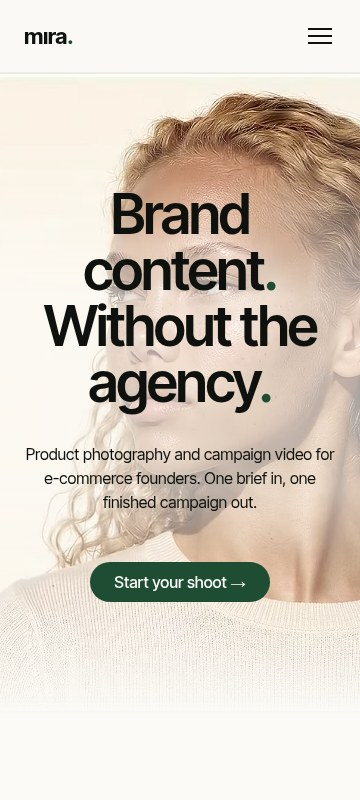

# Mira Content Studio Marketing Site

[](https://github.com/mirasolutions06/mira-content-studio-site/actions/workflows/ci.yml)

This repo is the public showcase layer for Mira Content Studio. The generation engine is
private; this repo contains the customer-facing static site, design system, portfolio data,
and launch assets.

**Live:** [miracontent.studio](https://miracontent.studio)

## Preview











The generation and orchestration engine is private; this repo contains the public showcase
site and design system.

> **What this repo proves:** front-end engineering, a token-driven design system, static
> export and deployment, typed content structure, and product presentation. It is the
> showcase layer, not the generation engine. For how the whole product fits together, see
> [`CASE_STUDY.md`](CASE_STUDY.md), [`docs/architecture.md`](docs/architecture.md), and
> [`docs/private-engine-overview.md`](docs/private-engine-overview.md).

## Stack

| | |
|---|---|
| Framework | Next.js 15 (App Router, React 19) |
| Language | TypeScript (strict) |
| Styling | Tailwind CSS v4, driven entirely by design tokens |
| Motion | Framer Motion |
| Fonts | Inter Tight, self-hosted via `next/font` (no external font requests) |
| Output | Static export (`output: 'export'`), no server runtime |
| Hosting | Cloudflare |
| CI | GitHub Actions type-checks and builds the static export on every push |

## What's worth a look

- **One source for color and type.** Every color, font size, weight, and spacing step lives
  in [`design-tokens/`](design-tokens/) as both CSS custom properties (`tokens.css`) and a
  typed Tailwind theme (`tokens.ts`). Components reference tokens only, never raw hex, so the
  site and the wider brand system cannot drift apart.
- **Motion-led hero.** [`components/hero/`](components/hero/) composes a typed-prompt input, a
  streaming-style chat sequence, and a Ken Burns crossfade between result stills, choreographed
  from a single timeline in [`lib/heroChoreography.ts`](lib/heroChoreography.ts).
- **Data-driven work grid.** Case studies are plain JSON in
  [`content/projects/`](content/projects/), typed by [`lib/types.ts`](lib/types.ts) and read at
  build time by [`lib/projects.ts`](lib/projects.ts). Adding a project is a file, not a code
  change.
- **Self-serve commerce, guarded.** Checkout (Stripe Payment Links) and the post-purchase
  booking link each have a single source of truth in [`lib/`](lib/), with a
  `CHECKOUT_IS_TEST_MODE` flag so test links can never ship to production unnoticed.
- **Built for sharing.** Generated `sitemap.ts` and `robots.ts`, an Open Graph card, and a
  self-hosted favicon set. The OG image is built from a source photo by
  [`scripts/build-og-image.py`](scripts/build-og-image.py).

## Run it locally

```bash
npm install
npm run dev      # http://localhost:3000
npm run build    # static export to ./out
```

Node 22 (matching CI). The build produces a fully static `out/` directory that any static host
can serve.

## Structure

```
app/                 App Router routes (home, privacy, terms, intake thank-you)
components/          Section and UI components
  hero/              The animated prompt-to-image hero
content/projects/    Case-study data (JSON)
design-tokens/       Color and type tokens, the single styling source
lib/                 Data loading, checkout and booking links, hero choreography
public/              Imagery, video loops, favicons, OG card
scripts/             Build helpers (OG image, image tiles)
docs/                Architecture and the private-engine overview
```

## A note on the imagery

The brands shown in the portfolio (GJeans, Avenir, Botanica, Mare, Objet, Tildeo) are demo
work created to fill the studio's launch portfolio. They are illustrative, not real clients.

## License

Source-available for review. Not licensed for reuse.
